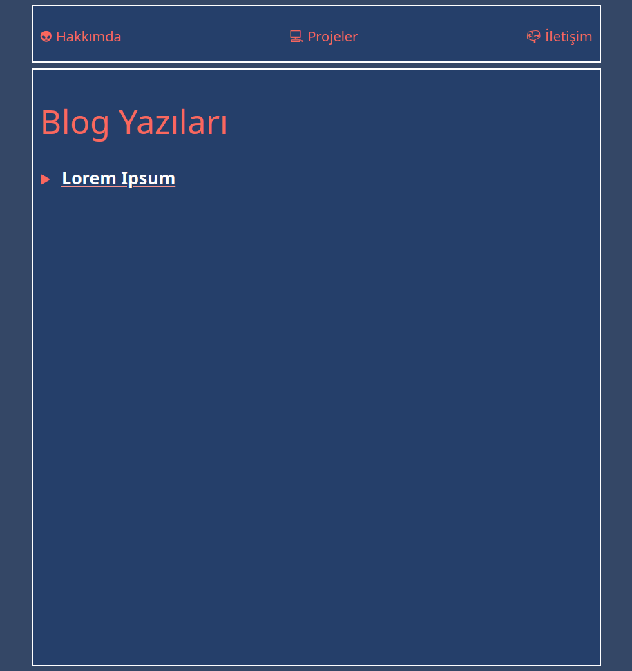
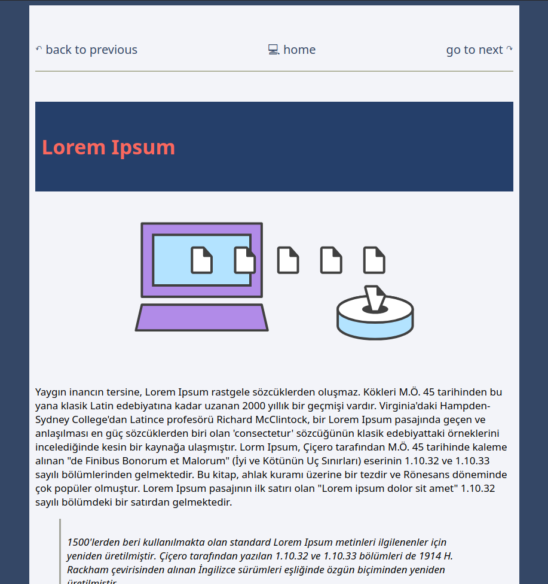

# Blog

This repository includes my blog.

The motivation doing this project is understand how a small backend project works.

# Usage

If you want to use this project for your blog you need to follow the orders below 

# Sample images

