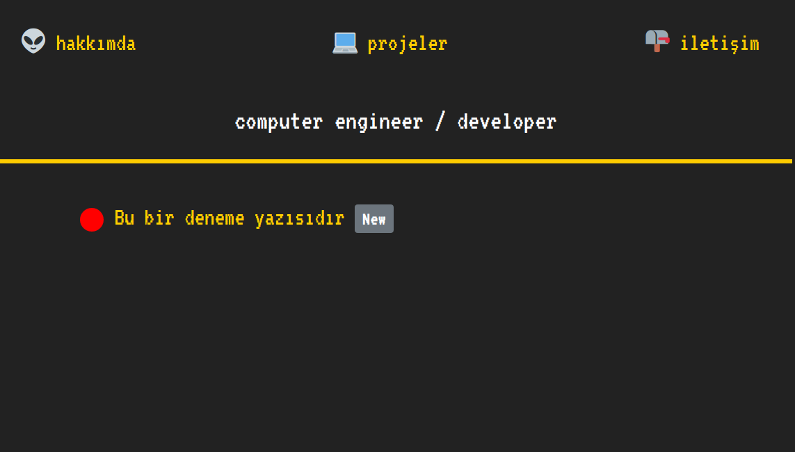
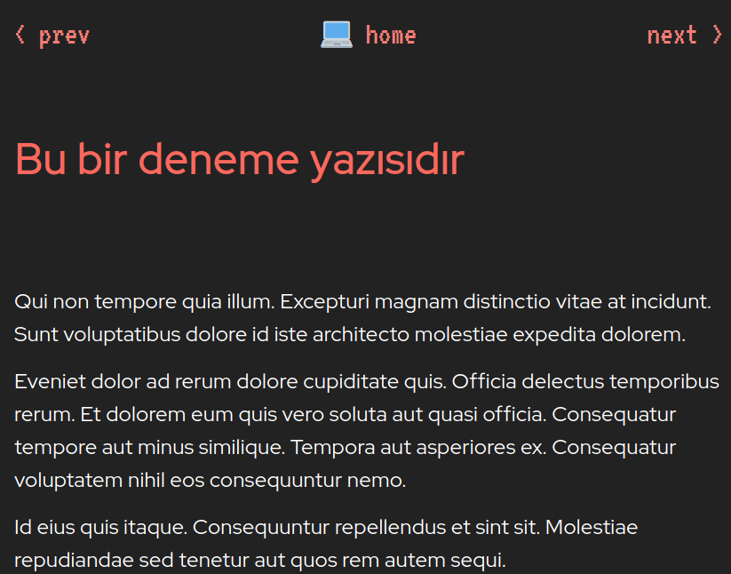
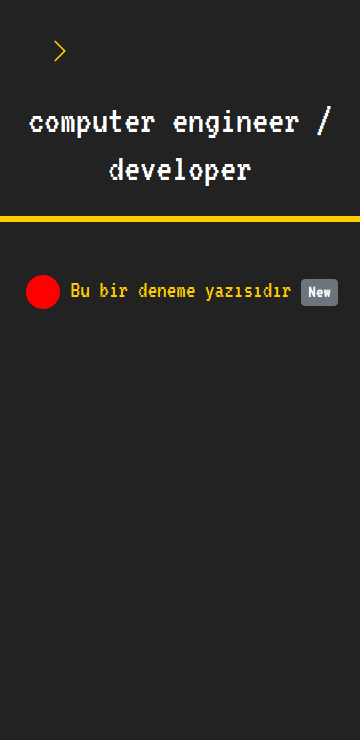
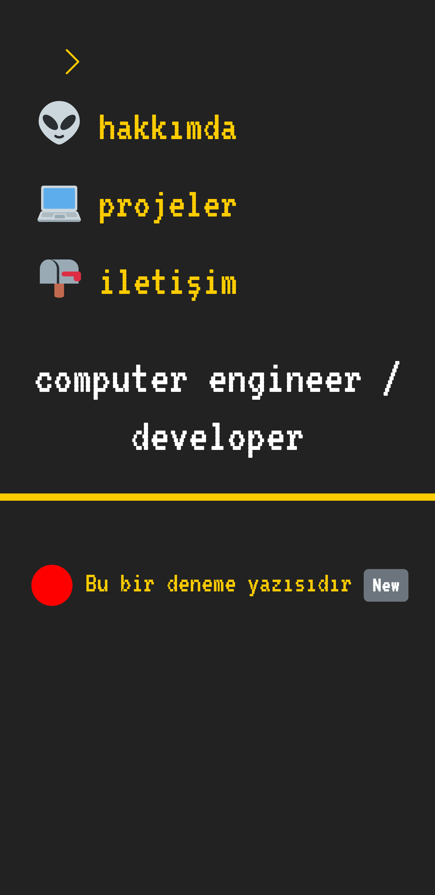

# Blog

This repository includes my blog.

The motivation doing this project is understand how a small backend project works and learn how to deploy a project on Linux server.

Here is my [blog](http://yasinacierik.xyz)

Empty for now but hopefully nice articles will come in the future

# Documentation

The construction and deploy stages of the blog

# Sample images

<!--
    responsive anlatırken eklenecek
 
 -->
